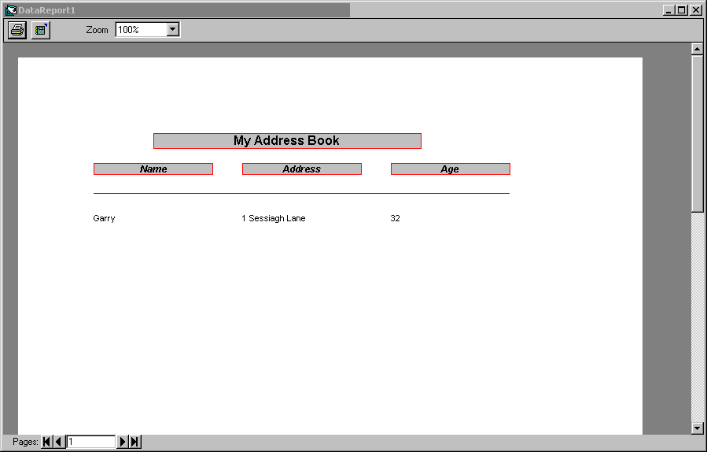



## VB DataReport OCX to access2000

### Description

A vb test application which opens queries from access instead of tables for a datareport.I could not individually open selected records so i made this instead.
 
### More Info
 

             |
---                |---
**Submitted On**   |2004-01-13 12:53:54
**By**             |[Garry Thompson](https://github.com/Planet-Source-Code/PSCIndex/blob/master/ByAuthor/garry-thompson.md)
**Level**          |Intermediate
**User Rating**    |4.6 (23 globes from 5 users)
**Compatibility**  |VB 6\.0
**Category**       |[Databases/ Data Access/ DAO/ ADO](https://github.com/Planet-Source-Code/PSCIndex/blob/master/ByCategory/databases-data-access-dao-ado__1-6.md)
**World**          |[Visual Basic](https://github.com/Planet-Source-Code/PSCIndex/blob/master/ByWorld/visual-basic.md)
**Archive File**   |[VB\_DataRep1695131162004\.zip](https://github.com/Planet-Source-Code/garry-thompson-vb-datareport-ocx-to-access2000__1-51050/archive/master.zip)

